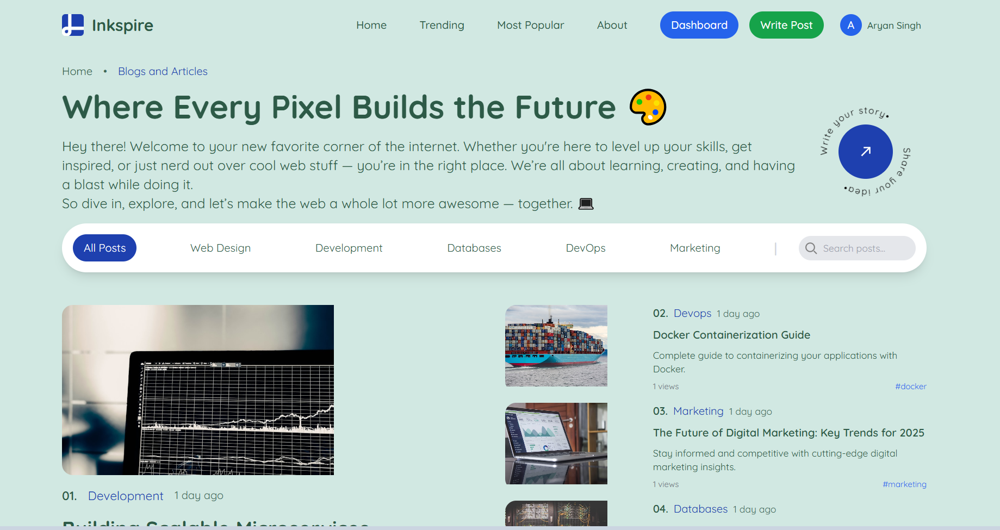

# 📝 Full Stack Blog Application (MERN)

A feature-rich **Blog Application** built entirely from scratch using the **MERN Stack** – MongoDB, Express.js, React.js, and Node.js.  
This project implements a fully functional blogging platform with secure authentication, a rich text editor, and a clean responsive UI.

---

## 🔗 Live Demo

👉 [Click Here to View the Live App](https://blog-post-theta-three.vercel.app/)

## 📸 Preview

<!-- Add your project screenshot or GIF below -->

---

## 🚀 Features

- 🔐 **JWT Authentication** – Secure login and registration
- 📝 **CRUD Operations** – Create, Read, Update, Delete blog posts
- ✨ **Rich Text Editor** – Write and format blogs beautifully
- 🖼️ **Responsive UI** – Built using Tailwind CSS
- 🔄 **Protected Routes** – Role-based and auth-based access
- 🌐 **REST API Integration** – Robust backend with Express.js

---

## 🛠️ Tech Stack

| Frontend      | Backend        | Database | Auth     | Styling       |
| ------------- | -------------- | -------- | -------- | ------------- |
| React.js      | Node.js        | MongoDB  | JWT      | Tailwind CSS  |
| Redux (optional) | Express.js  |          | BcryptJS | Rich Text Editor |

---

🛠️ **Made with ❤️ by [Gaurav Gupta](https://www.linkedin.com/in/gaurav-gupta-097069261)**  
📫 Reach out: officialgauravgupta3@gmail.com
